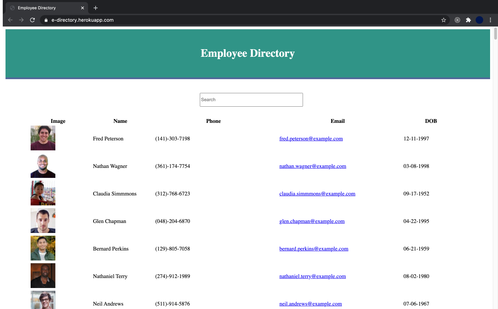

# Unit 19 React Homework: Employee Directory

## Description
For this assignment, I'll create a employee directory with React. It's required to break up the application's UI into components, manage component state, and respond to user events.

## Project links
<li>GitHub link: https://github.com/huqian301/Employee-Directory </li>
<li>Heroku link: https://e-directory.herokuapp.com/</li>

## Output 
Here is the [Video](https://drive.google.com/file/d/1bvVZIKEYn9NQzCyEKoVg6ocHo2A1HHbX/view?usp=sharing) that shows entire page. 

The final page will be look like as below image.

 

